# EMNLP 2025 Main Conference Papers

**Summary:** 30 papers with extracted content:
- 📊 Total images: 14618
- 📋 Total tables: 17648
- 📄 Total files: 32266

*Note: Equations have been filtered out and are not included.*

---

# EMNLP 2025 Main Papers - Part 17 of 60

## 目录 (Table of Contents)

1. [CROP: Contextual Region-Oriented Visual Token Pruning](#CROP-Contextual-Region-Oriented-Visual-Token-Pruning)
2. [CR4-NarrEmote: An Open Vocabulary Dataset of Narrative Emotions Derived Using Citizen Science](#CR4-NarrEmote-An-Open-Vocabulary-Dataset-of-Narrative-Emotions-Derived-Using-Citizen-Science)
3. [XQuant: Achieving Ultra-Low BitKVCache Quantization with Cross-Layer Compression](#XQuant-Achieving-Ultra-Low-BitKVCache-Quantization-with-Cross-Layer-Compression)
4. [DINTTransformer](#DINTTransformer)
5. [ICR: Iterative Clarification and Rewriting for Conversational Search](#ICR-Iterative-Clarification-and-Rewriting-for-Conversational-Search)
6. [Pre-trainingCLIPagainst Data Poisoning with Optimal Transport-based Matching and Alignment](#Pre-trainingCLIPagainst-Data-Poisoning-with-Optimal-Transport-based-Matching-and-Alignment)
7. [Similarity = Value? Consultation Value-Assessment and Alignment for Personalized Search](#Similarity-Value-Consultation-Value-Assessment-and-Alignment-for-Personalized-Search)
8. [RTQA: Recursive Thinking for Complex Temporal Knowledge Graph Question Answering with Large Language Models](#RTQA-Recursive-Thinking-for-Complex-Temporal-Knowledge-Graph-Question-Answering-with-Large-Language-Models)
9. [Not All Parameters Are Created Equal: Smart Isolation Boosts Fine-Tuning Performance](#Not-All-Parameters-Are-Created-Equal-Smart-Isolation-Boosts-Fine-Tuning-Performance)
10. [AIKnows Where You Are: Exposure, Bias, and Inference in Multimodal Geolocation withKoreaGEO](#AIKnows-Where-You-Are-Exposure-Bias-and-Inference-in-Multimodal-Geolocation-withKoreaGEO)
11. [CAT: Causal Attention Tuning For Injecting Fine-grained Causal Knowledge into Large Language Models](#CAT-Causal-Attention-Tuning-For-Injecting-Fine-grained-Causal-Knowledge-into-Large-Language-Models)
12. [EnhancingLLMText Detection with Retrieved Contexts and Logits Distribution Consistency](#EnhancingLLMText-Detection-with-Retrieved-Contexts-and-Logits-Distribution-Consistency)
13. [Measuring Chain of Thought Faithfulness by Unlearning Reasoning Steps](#Measuring-Chain-of-Thought-Faithfulness-by-Unlearning-Reasoning-Steps)
14. [Stop Looking for “Important Tokens” in Multimodal Language Models: Duplication Matters More](#Stop-Looking-for-Important-Tokens-in-Multimodal-Language-Models-Duplication-Matters-More)
15. [AgentPro: EnhancingLLMAgents with Automated Process Supervision](#AgentPro-EnhancingLLMAgents-with-Automated-Process-Supervision)
16. [PORTS: Preference-Optimized Retrievers for Tool Selection with Large Language Models](#PORTS-Preference-Optimized-Retrievers-for-Tool-Selection-with-Large-Language-Models)
17. [MusKGC: A Flexible Multi-source Knowledge Enhancement Framework for Open-World Knowledge Graph Completion](#MusKGC-A-Flexible-Multi-source-Knowledge-Enhancement-Framework-for-Open-World-Knowledge-Graph-Completion)
18. [Towards Transferable Personality Representation Learning based on Triplet Comparisons and Its Applications](#Towards-Transferable-Personality-Representation-Learning-based-on-Triplet-Comparisons-and-Its-Applications)
19. [Reshaping Representation Space to Balance the Safety and Over-rejection in Large Audio Language Models](#Reshaping-Representation-Space-to-Balance-the-Safety-and-Over-rejection-in-Large-Audio-Language-Models)
20. [Benchmarking Large Language Models Under Data Contamination: A Survey from Static to Dynamic Evaluation](#Benchmarking-Large-Language-Models-Under-Data-Contamination-A-Survey-from-Static-to-Dynamic-Evaluation)
21. [FinTrust: A Comprehensive Benchmark of Trustworthiness Evaluation in Finance Domain](#FinTrust-A-Comprehensive-Benchmark-of-Trustworthiness-Evaluation-in-Finance-Domain)
22. [RecGPT: A Foundation Model for Sequential Recommendation](#RecGPT-A-Foundation-Model-for-Sequential-Recommendation)
23. [Towards Holistic Evaluation of Large Audio-Language Models: A Comprehensive Survey](#Towards-Holistic-Evaluation-of-Large-Audio-Language-Models-A-Comprehensive-Survey)
24. [Train One Sparse Autoencoder Across Multiple Sparsity Budgets to Preserve Interpretability and Accuracy](#Train-One-Sparse-Autoencoder-Across-Multiple-Sparsity-Budgets-to-Preserve-Interpretability-and-Accuracy)
25. [Learn and Unlearn: Addressing Misinformation in MultilingualLLMs](#Learn-and-Unlearn-Addressing-Misinformation-in-MultilingualLLMs)
26. [PRISM: Efficient Long-Range Reasoning With Short-ContextLLMs](#PRISM-Efficient-Long-Range-Reasoning-With-Short-ContextLLMs)
27. [Augmenting Multi-Agent Communication with State Delta Trajectory](#Augmenting-Multi-Agent-Communication-with-State-Delta-Trajectory)
28. [SAEs Are Good for Steering – If You Select the Right Features](#SAEs-Are-Good-for-Steering-If-You-Select-the-Right-Features)
29. [CoBA: Counterbias Text Augmentation for Mitigating Various Spurious Correlations via Semantic Triples](#CoBA-Counterbias-Text-Augmentation-for-Mitigating-Various-Spurious-Correlations-via-Semantic-Triples)
30. [Layered Insights: Generalizable Analysis of Human Authorial Style by Leveraging All Transformer Layers](#Layered-Insights-Generalizable-Analysis-of-Human-Authorial-Style-by-Leveraging-All-Transformer-Layers)

---

## CROP: Contextual Region-Oriented Visual Token Pruning

### Images

### Tables

## CROP: Contextual Region-Oriented Visual Token Pruning

### Images

### Tables

## CR4-NarrEmote: An Open Vocabulary Dataset of Narrative Emotions Derived Using Citizen Science

### Images

### Tables

## XQuant: Achieving Ultra-Low BitKVCache Quantization with Cross-Layer Compression

### Images

### Tables

## DINTTransformer

### Images

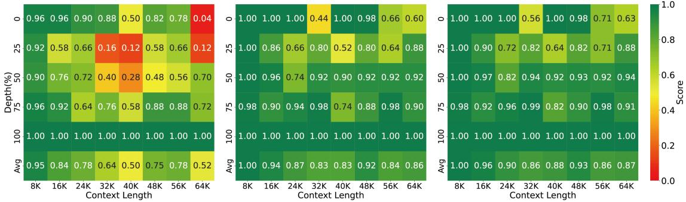

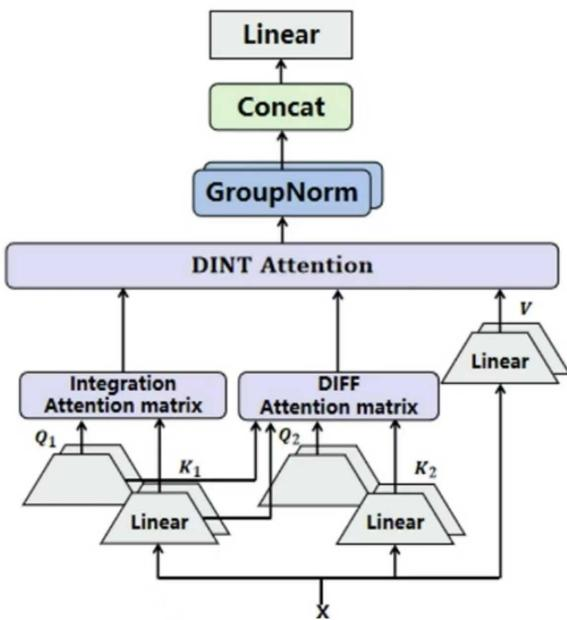

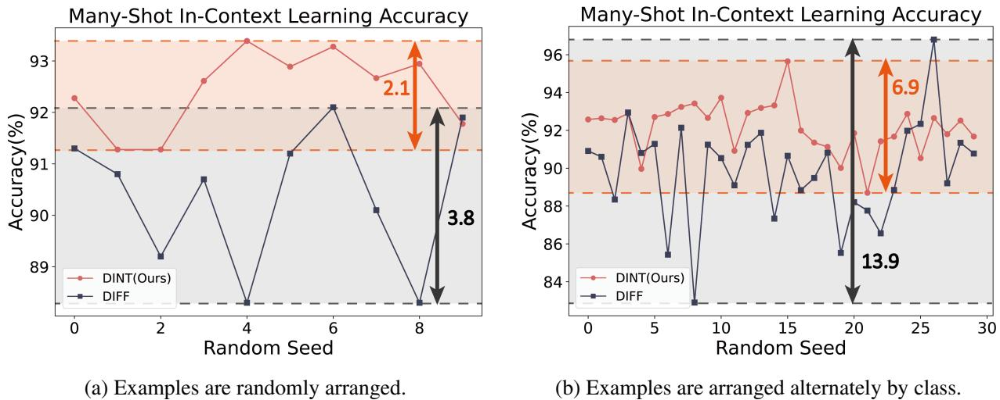

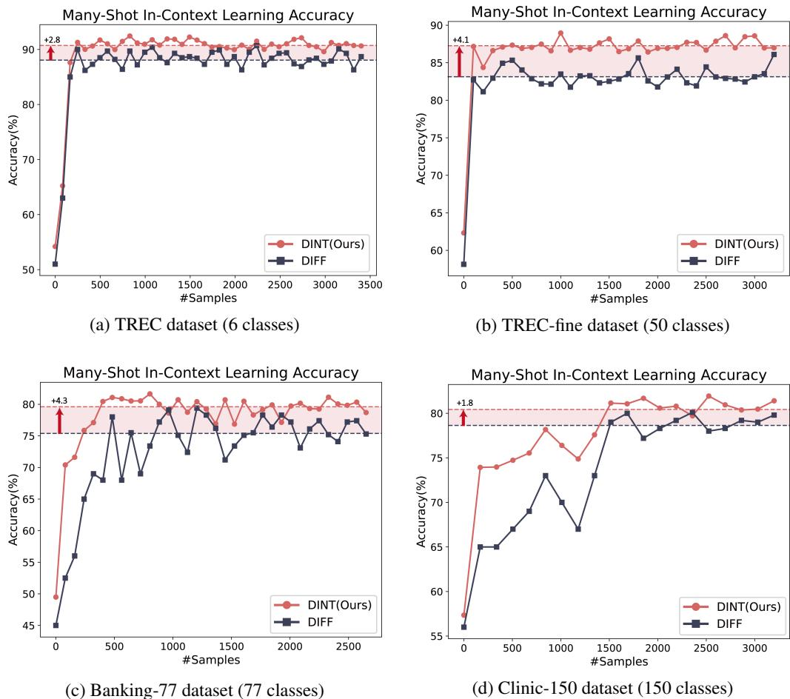

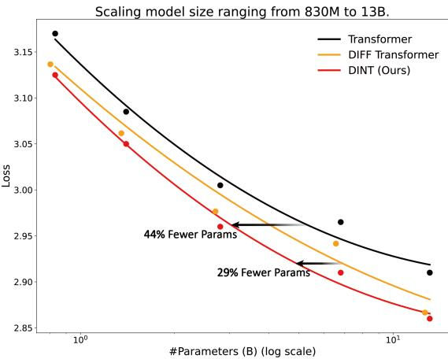

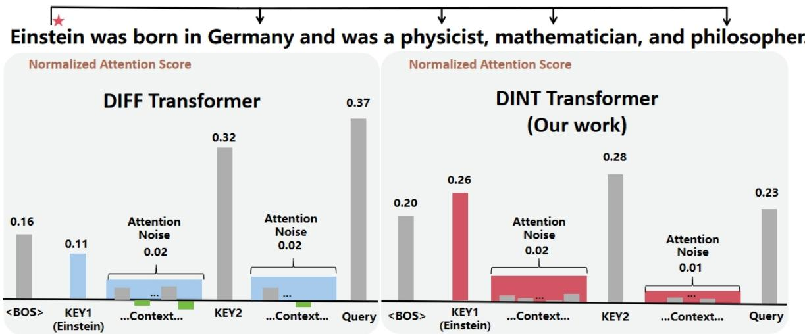

### Tables

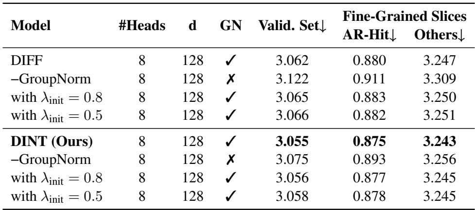

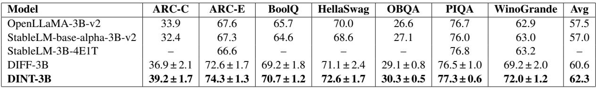

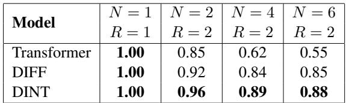

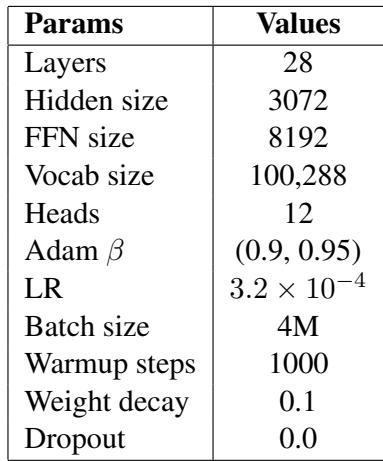

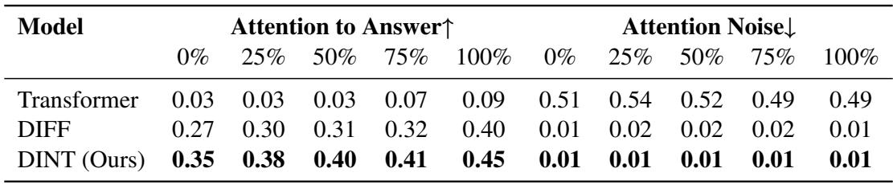

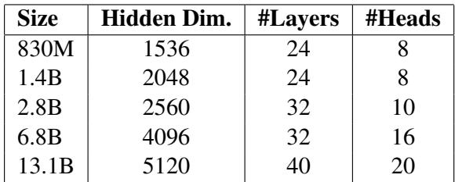

## ICR: Iterative Clarification and Rewriting for Conversational Search

### Images

### Tables

## Pre-trainingCLIPagainst Data Poisoning with Optimal Transport-based Matching and Alignment

### Images

### Tables

## Similarity = Value? Consultation Value-Assessment and Alignment for Personalized Search

### Images

### Tables

## RTQA: Recursive Thinking for Complex Temporal Knowledge Graph Question Answering with Large Language Models

### Images

### Tables

## Not All Parameters Are Created Equal: Smart Isolation Boosts Fine-Tuning Performance

### Images

### Tables

## AIKnows Where You Are: Exposure, Bias, and Inference in Multimodal Geolocation withKoreaGEO

### Images

### Tables

## CAT: Causal Attention Tuning For Injecting Fine-grained Causal Knowledge into Large Language Models

### Images

### Tables

## EnhancingLLMText Detection with Retrieved Contexts and Logits Distribution Consistency

### Images

### Tables

## Measuring Chain of Thought Faithfulness by Unlearning Reasoning Steps

### Images

### Tables

## Stop Looking for “Important Tokens” in Multimodal Language Models: Duplication Matters More

### Images

### Tables

## AgentPro: EnhancingLLMAgents with Automated Process Supervision

### Images

### Tables

## PORTS: Preference-Optimized Retrievers for Tool Selection with Large Language Models

### Images

### Tables

## MusKGC: A Flexible Multi-source Knowledge Enhancement Framework for Open-World Knowledge Graph Completion

### Images

### Tables

## Towards Transferable Personality Representation Learning based on Triplet Comparisons and Its Applications

### Images

### Tables

## Reshaping Representation Space to Balance the Safety and Over-rejection in Large Audio Language Models

### Images

### Tables

## Benchmarking Large Language Models Under Data Contamination: A Survey from Static to Dynamic Evaluation

### Images

### Tables

## FinTrust: A Comprehensive Benchmark of Trustworthiness Evaluation in Finance Domain

### Images

### Tables

## RecGPT: A Foundation Model for Sequential Recommendation

### Images

### Tables

## Towards Holistic Evaluation of Large Audio-Language Models: A Comprehensive Survey

### Images

### Tables

## Train One Sparse Autoencoder Across Multiple Sparsity Budgets to Preserve Interpretability and Accuracy

### Images

### Tables

## Learn and Unlearn: Addressing Misinformation in MultilingualLLMs

### Images

### Tables

## PRISM: Efficient Long-Range Reasoning With Short-ContextLLMs

### Images

### Tables

## Augmenting Multi-Agent Communication with State Delta Trajectory

### Images

### Tables

## SAEs Are Good for Steering – If You Select the Right Features

### Images

### Tables

## CoBA: Counterbias Text Augmentation for Mitigating Various Spurious Correlations via Semantic Triples

### Images

### Tables

## Layered Insights: Generalizable Analysis of Human Authorial Style by Leveraging All Transformer Layers

### Images

### Tables

