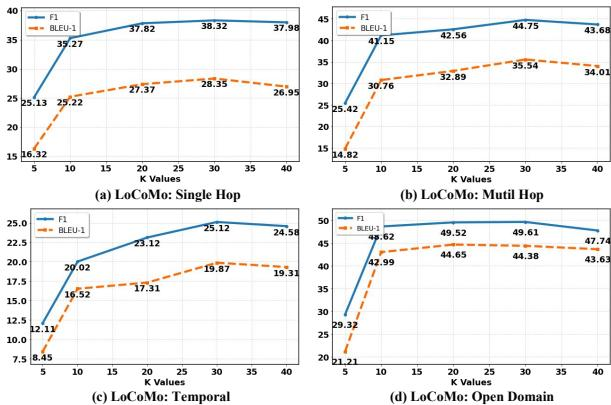
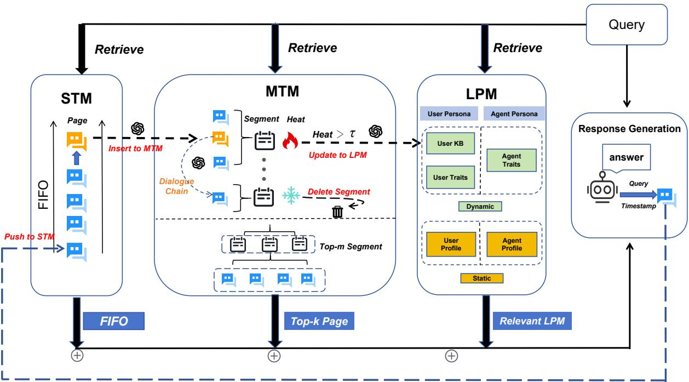
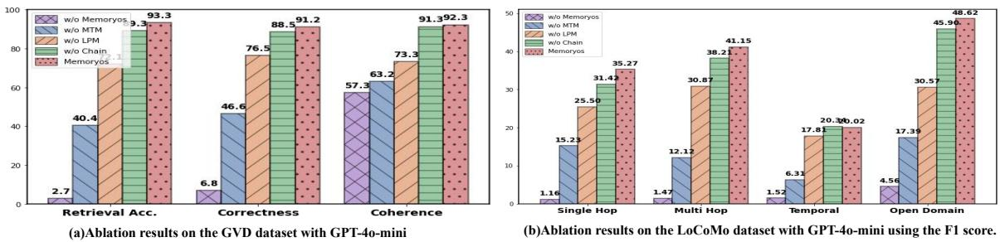
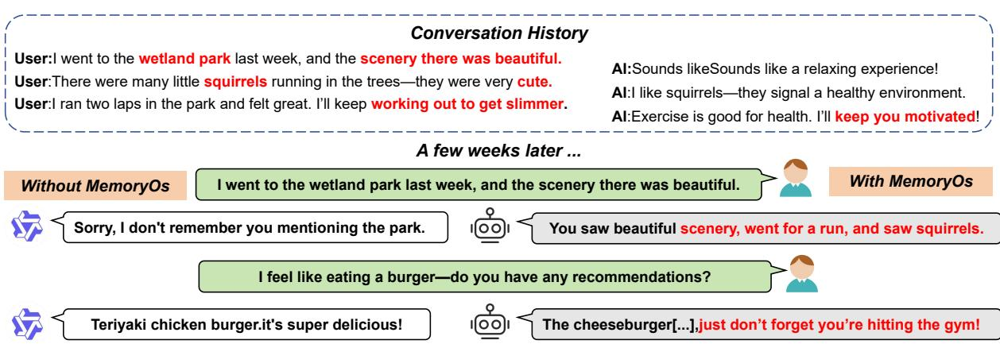
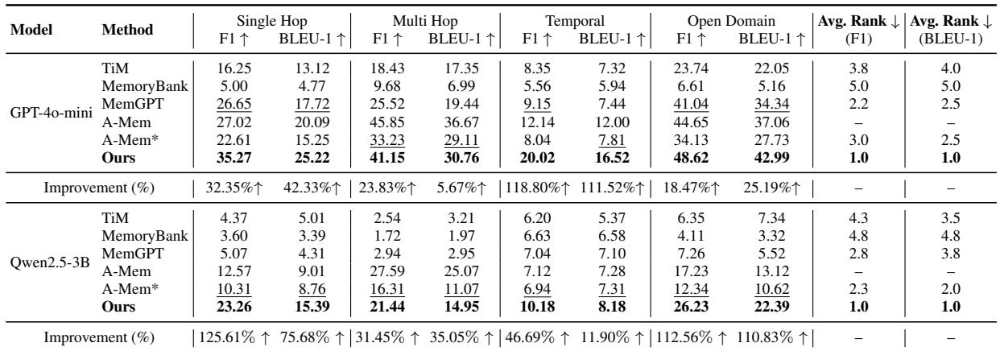
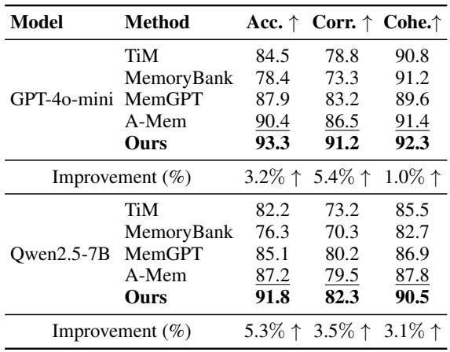
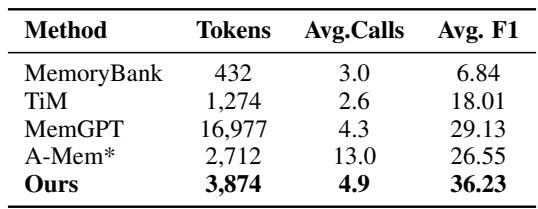

# EMNLP 2025 Main Conference Papers

**Summary:** 30 papers with extracted content:
- 📊 Total images: 14618
- 📋 Total tables: 17648
- 📄 Total files: 32266

*Note: Equations have been filtered out and are not included.*

---

# EMNLP 2025 Main Papers - Part 43 of 60

## 目录 (Table of Contents)

1. [HypER: Literature-grounded Hypothesis Generation and Distillation with Provenance](#HypER-Literature-grounded-Hypothesis-Generation-and-Distillation-with-Provenance)
2. [EmpoweringGraphRAGwith Knowledge Filtering and Integration](#EmpoweringGraphRAGwith-Knowledge-Filtering-and-Integration)
3. [Interpretable Mnemonic Generation for Kanji Learning via Expectation-Maximization](#Interpretable-Mnemonic-Generation-for-Kanji-Learning-via-Expectation-Maximization)
4. [Refining Attention for Explainable and Noise-Robust Fact-Checking with Transformers](#Refining-Attention-for-Explainable-and-Noise-Robust-Fact-Checking-with-Transformers)
5. [Harmful Prompt Laundering: JailbreakingLLMs with Abductive Styles and Symbolic Encoding](#Harmful-Prompt-Laundering-JailbreakingLLMs-with-Abductive-Styles-and-Symbolic-Encoding)
6. [Pathway to Relevance: How Cross-Encoders Implement a Semantic Variant ofBM25](#Pathway-to-Relevance-How-Cross-Encoders-Implement-a-Semantic-Variant-ofBM25)
7. [Rewarding the Unlikely: LiftingGRPOBeyond Distribution Sharpening](#Rewarding-the-Unlikely-LiftingGRPOBeyond-Distribution-Sharpening)
8. [PhoniTale: Phonologically Grounded Mnemonic Generation for Typologically Distant Language Pairs](#PhoniTale-Phonologically-Grounded-Mnemonic-Generation-for-Typologically-Distant-Language-Pairs)
9. [Amulet: Putting Complex Multi-Turn Conversations on the Stand withLLMJuries](#Amulet-Putting-Complex-Multi-Turn-Conversations-on-the-Stand-withLLMJuries)
10. [Exploring Chain-of-Thought Reasoning for Steerable Pluralistic Alignment](#Exploring-Chain-of-Thought-Reasoning-for-Steerable-Pluralistic-Alignment)
11. [CMedCalc-Bench: A Fine-Grained Benchmark forChinese Medical Calculations inLLM](#CMedCalc-Bench-A-Fine-Grained-Benchmark-forChinese-Medical-Calculations-inLLM)
12. [Evaluating Robustness of Large Audio Language Models to Audio Injection: An Empirical Study](#Evaluating-Robustness-of-Large-Audio-Language-Models-to-Audio-Injection-An-Empirical-Study)
13. [How Far CanLLMs Improve from Experience? Measuring Test-Time Learning Ability inLLMs with Human Comparison](#How-Far-CanLLMs-Improve-from-Experience-Measuring-Test-Time-Learning-Ability-inLLMs-with-Human-Comparison)
14. [Subtle Risks, Critical Failures: A Framework for Diagnosing Physical Safety ofLLMs for Embodied Decision Making](#Subtle-Risks-Critical-Failures-A-Framework-for-Diagnosing-Physical-Safety-ofLLMs-for-Embodied-Decision-Making)
15. [SwiftKV: Fast Prefill-Optimized Inference with Knowledge-Preserving Model Transformation](#SwiftKV-Fast-Prefill-Optimized-Inference-with-Knowledge-Preserving-Model-Transformation)
16. [Co-Eval: AugmentingLLM-based Evaluation with Machine Metrics](#Co-Eval-AugmentingLLM-based-Evaluation-with-Machine-Metrics)
17. [Sali4Vid: Saliency-Aware Video Reweighting and Adaptive Caption Retrieval for Dense Video Captioning](#Sali4Vid-Saliency-Aware-Video-Reweighting-and-Adaptive-Caption-Retrieval-for-Dense-Video-Captioning)
18. [Semantic Networks Extracted from Students’ Think-Aloud Data are Correlated with Students’ Learning Performance](#Semantic-Networks-Extracted-from-Students-Think-Aloud-Data-are-Correlated-with-Students-Learning-Performance)
19. [Less is More: The Effectiveness of Compact Typological Language Representations](#Less-is-More-The-Effectiveness-of-Compact-Typological-Language-Representations)
20. [Sparse Activation Editing for Reliable Instruction Following in Narratives](#Sparse-Activation-Editing-for-Reliable-Instruction-Following-in-Narratives)
21. [Inceptive Transformers: Enhancing Contextual Representations through Multi-Scale Feature Learning Across Domains and Languages](#Inceptive-Transformers-Enhancing-Contextual-Representations-through-Multi-Scale-Feature-Learning-Across-Domains-and-Languages)
22. [Causal Tree Extraction from Medical Case Reports: A Novel Task for Experts-like Text Comprehension](#Causal-Tree-Extraction-from-Medical-Case-Reports-A-Novel-Task-for-Experts-like-Text-Comprehension)
23. [OWL: Probing Cross-Lingual Recall of Memorized Texts via World Literature](#OWL-Probing-Cross-Lingual-Recall-of-Memorized-Texts-via-World-Literature)
24. [Enhanced Noun-Noun Compound Interpretation through Textual Enrichment](#Enhanced-Noun-Noun-Compound-Interpretation-through-Textual-Enrichment)
25. [ICLCIPHERS: Quantifying ”Learning” in In-Context Learning via Substitution Ciphers](#ICLCIPHERS-Quantifying-Learning-in-In-Context-Learning-via-Substitution-Ciphers)
26. [Corrupted but Not Broken: Understanding and Mitigating the Negative Impacts of Corrupted Data in Visual Instruction Tuning](#Corrupted-but-Not-Broken-Understanding-and-Mitigating-the-Negative-Impacts-of-Corrupted-Data-in-Visual-Instruction-Tuning)
27. [MemoryOSofAIAgent](#MemoryOSofAIAgent)
28. [Rule Discovery for Natural Language Inference Data Generation Using Out-of-Distribution Detection](#Rule-Discovery-for-Natural-Language-Inference-Data-Generation-Using-Out-of-Distribution-Detection)
29. [Jigsaw-Puzzles: From Seeing to Understanding to Reasoning in Vision-Language Models](#Jigsaw-Puzzles-From-Seeing-to-Understanding-to-Reasoning-in-Vision-Language-Models)
30. [Definition Generation for Word Meaning Modeling: Monolingual, Multilingual, and Cross-Lingual Perspectives](#Definition-Generation-for-Word-Meaning-Modeling-Monolingual-Multilingual-and-Cross-Lingual-Perspectives)

---

## HypER: Literature-grounded Hypothesis Generation and Distillation with Provenance

### Images

### Tables

## HypER: Literature-grounded Hypothesis Generation and Distillation with Provenance

### Images

### Tables

## EmpoweringGraphRAGwith Knowledge Filtering and Integration

### Images

### Tables

## Interpretable Mnemonic Generation for Kanji Learning via Expectation-Maximization

### Images

### Tables

## Refining Attention for Explainable and Noise-Robust Fact-Checking with Transformers

### Images

### Tables

## Harmful Prompt Laundering: JailbreakingLLMs with Abductive Styles and Symbolic Encoding

### Images

### Tables

## Pathway to Relevance: How Cross-Encoders Implement a Semantic Variant ofBM25

### Images

### Tables

## Rewarding the Unlikely: LiftingGRPOBeyond Distribution Sharpening

### Images

### Tables

## PhoniTale: Phonologically Grounded Mnemonic Generation for Typologically Distant Language Pairs

### Images

### Tables

## Amulet: Putting Complex Multi-Turn Conversations on the Stand withLLMJuries

### Images

### Tables

## Exploring Chain-of-Thought Reasoning for Steerable Pluralistic Alignment

### Images

### Tables

## CMedCalc-Bench: A Fine-Grained Benchmark forChinese Medical Calculations inLLM

### Images

### Tables

## Evaluating Robustness of Large Audio Language Models to Audio Injection: An Empirical Study

### Images

### Tables

## How Far CanLLMs Improve from Experience? Measuring Test-Time Learning Ability inLLMs with Human Comparison

### Images

### Tables

## Subtle Risks, Critical Failures: A Framework for Diagnosing Physical Safety ofLLMs for Embodied Decision Making

### Images

### Tables

## SwiftKV: Fast Prefill-Optimized Inference with Knowledge-Preserving Model Transformation

### Images

### Tables

## Co-Eval: AugmentingLLM-based Evaluation with Machine Metrics

### Images

### Tables

## Sali4Vid: Saliency-Aware Video Reweighting and Adaptive Caption Retrieval for Dense Video Captioning

### Images

### Tables

## Semantic Networks Extracted from Students’ Think-Aloud Data are Correlated with Students’ Learning Performance

### Images

### Tables

## Less is More: The Effectiveness of Compact Typological Language Representations

### Images

### Tables

## Sparse Activation Editing for Reliable Instruction Following in Narratives

### Images

### Tables

## Inceptive Transformers: Enhancing Contextual Representations through Multi-Scale Feature Learning Across Domains and Languages

### Images

### Tables

## Causal Tree Extraction from Medical Case Reports: A Novel Task for Experts-like Text Comprehension

### Images

### Tables

## OWL: Probing Cross-Lingual Recall of Memorized Texts via World Literature

### Images

### Tables

## Enhanced Noun-Noun Compound Interpretation through Textual Enrichment

### Images

### Tables

## ICLCIPHERS: Quantifying ”Learning” in In-Context Learning via Substitution Ciphers

### Images

### Tables

## Corrupted but Not Broken: Understanding and Mitigating the Negative Impacts of Corrupted Data in Visual Instruction Tuning

### Images

### Tables

## MemoryOSofAIAgent

### Images

### Tables

## Rule Discovery for Natural Language Inference Data Generation Using Out-of-Distribution Detection

### Images

### Tables

## Jigsaw-Puzzles: From Seeing to Understanding to Reasoning in Vision-Language Models

### Images

### Tables

## Definition Generation for Word Meaning Modeling: Monolingual, Multilingual, and Cross-Lingual Perspectives

### Images

### Tables

